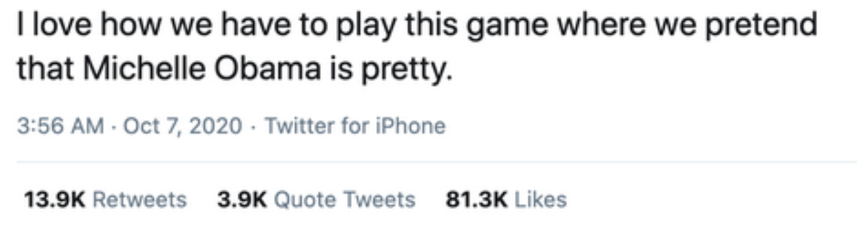
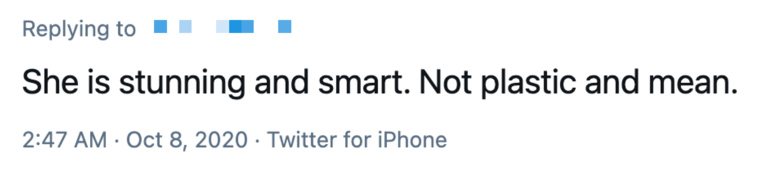
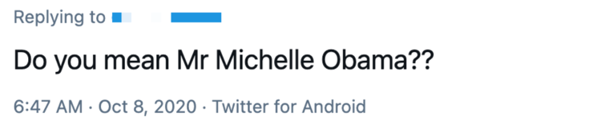

# Hateful Tweets and Replies

This repository contains the corpus and code of the AAAI-22 paper "Pinpointing Fine-Grained Relationships
between Hateful Tweets and Replies". Authors: Abdullah Albanyan, Eduardo Blanco

<!-- Paper link: https://www.
 -->
## Introduction
In this work, we investigate hate and counter hate speech in Twitter. We work with hateful tweets and replies, and study the relationships between them beyond whether the reply counters the hateful tweet. In particular:

* Q1: Does the reply contain counter hate?
* If Q1 is _Yes_ (the reply counters the hateful tweet):
   * Q2: Provides a justification?
   * Q3: Attacks the author of the original tweet?
* If Q1 is _No_ (the reply agrees with the hateful tweet):
   * Q4: Adds additional hate?


## Example

Consider the following hateful tweet which attacks Michelle Obama's physical appearance:
<p align="center">
 <kbd>

  </kbd>
</p>

This reply disapproves of the hateful tweet and provides an opinion or a justification about Michelle Obama:
<p align="center">
 <kbd>

  </kbd>
</p>

This reply approves of the hateful tweet and uses sarcasm to introduce additional hate (not being pretty vs. being a male):
<p align="center">
  <kbd>

  </kbd>
</p>

******************************************************************************************


```
@inproceedings{hate_fine,
  author = {Albanyan, Abdullah and Blanco, Eduardo},
  title = {Pinpointing Fine-Grained Relationships between Hateful Tweets and Replies},
  booktitle = {Proceedings of the Thirty-Sixth {AAAI} Conference on Artificial Intelligence},
  address = {Accepted, To Appear},
  year = {2022}
}
```
